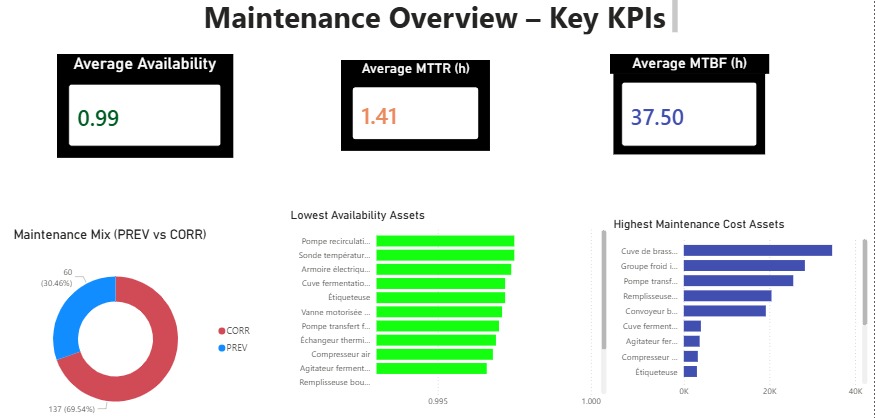
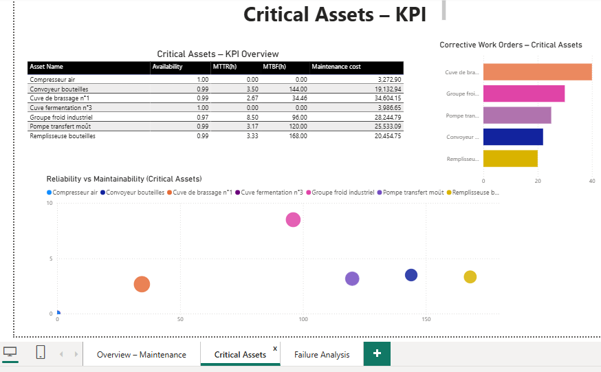
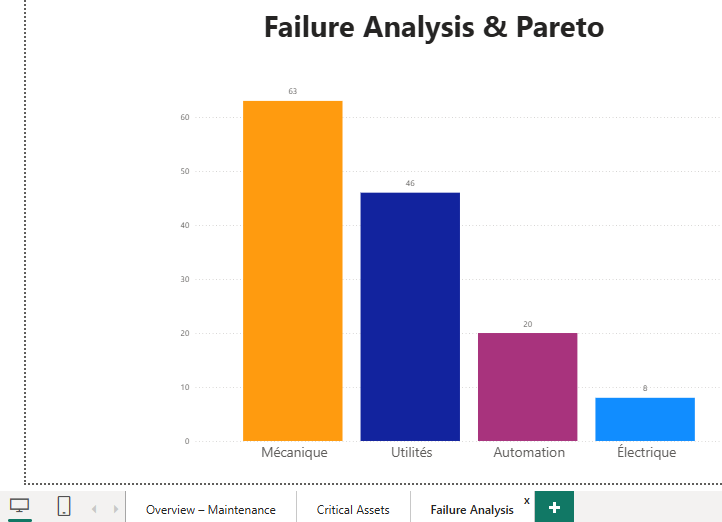

# Mini-CMMS / Industrial Maintenance Analytics (Synthetic Brewery Dataset)

## 🔗 Interactive Dashboard (GitHub Pages)
A fully interactive Power BI version of the dashboard is available here:

👉 **https://ioglas-af.github.io/industrial-maintenance/**

---

## 📌 Overview
This project implements a **data-driven mini-CMMS (GMAO)** based on a realistic industrial brewery environment.  
It covers the full maintenance data pipeline, from database design to KPI computation and decision-oriented dashboards.

The project is **fully reproducible** and based on **synthetic industrial maintenance data**, modeled to reflect real operational behavior.

---

## 🏭 Industrial Context — Brewery (Brasserie)
The simulated factory represents a typical industrial brewery, including:

- Brewing (vessels, pumps, heat exchangers)
- Fermentation (tanks, sensors, agitators)
- Packaging (fillers, conveyors, labellers)
- Utilities (cooling, compressed air, process water)
- Electrical & Automation systems

This context enables realistic modeling of mechanical, electrical, process and instrumentation failures.

---

## 🎯 Project Objectives
The goal is to demonstrate how to:

- design an industrial maintenance database,
- generate realistic synthetic failure and downtime events,
- compute core reliability KPIs (MTBF, MTTR, Availability),
- build a clean **SQL → Python → BI** data pipeline,
- support engineering decisions with interactive dashboards.

The focus is on **maintenance data engineering**, not only visualization.

---

## 🧰 Technology Stack
- **PostgreSQL** — relational database & KPI views  
- **SQL** — schema, data seeding, KPI logic  
- **Python** — data extraction and ETL (psycopg2, pandas)  
- **Power BI** — dashboards and analytics pages  
- **GitHub** — versioning and reproducibility  

---

## 🗄️ Database Model
The database schema reflects a real CMMS structure:

- `production_line` – production zones  
- `asset` – equipment with criticality (A/B/C)  
- `failure_mode` – failure families  
- `work_order` – preventive and corrective maintenance  
- `downtime_event` – stops, micro-stops, production impact  
- `wo_cost` – labor, spare parts, subcontracting  

Foreign keys enforce industrial maintenance workflows.

---

## 🧪 Synthetic Data Generation
Custom SQL scripts generate realistic industrial behavior:

- critical & secondary assets  
- recurring **bad actors**  
- preventive maintenance cycles  
- unplanned downtime & micro-stops  
- realistic cost distributions  

This yields meaningful MTBF, MTTR and availability indicators.

---

## 📊 KPI Computation (SQL Views)
All KPIs are computed **inside PostgreSQL**, including:

- Availability  
- MTTR (corrective maintenance)  
- MTBF  
- Preventive vs corrective mix  
- Failure Pareto (80/20)  
- Maintenance cost per asset  

A consolidated view `v_asset_kpi_context` organizes everything for BI consumption.

---

## 🐍 Python Integration Layer
Python handles:

- database connection  
- extraction of KPI views  
- export to Excel for Power BI  

No KPI logic is duplicated outside SQL.

---

## 📈 Power BI Dashboard Pages

### **1. Maintenance Overview — Key KPIs**

A global view of maintenance performance: availability, MTBF, MTTR, cost, and maintenance mix.

---

### **2. Critical Assets — Reliability & Performance**

Deep-dive into critical A-class assets, corrective work orders, and maintainability vs reliability trade-offs.

---

### **3. Failure Analysis & Pareto**

Failure modes Pareto, helping prioritize improvement actions following the 80/20 rule.

---

## 🏆 Project Value
This project demonstrates skills in:

- Industrial maintenance engineering  
- Reliability analysis (MTBF, MTTR, Availability)  
- Industrial data modeling  
- SQL for KPI computation  
- Python ETL  
- BI dashboard design (Power BI)  

It can be extended to predictive maintenance, OEE, anomaly detection, or real industrial datasets.

---
